# Johana Aylén Parrello

# Plataforma de Eventos e Inscripciones

API REST desarrollada con Node.js y Express para la gestión de eventos e inscripciones, implementando una arquitectura profesional por capas (**Router → Controller → Service → Repository → DAO → Modelo**).

Este repositorio corresponde a la **Pre-entrega 6 de Backend II (Coderhouse): Entidad events y lógica de negocio**.
Incluye:
- **CRUD completo de la entidad `Event`**: modelo Mongoose con validaciones a nivel de esquema, referencias (`ref: 'users'`), campos requeridos y tipos de datos estrictos.
- **Lógica de negocio desacoplada en la capa de servicios (`src/services/events.service.js`)**: validación de fechas futuras, capacidades y precios positivos, transiciones de estado y verificación de propiedad.
- **Control de permisos y propiedad**: roles `user`, `organizer` y `admin` con middlewares reutilizables. Solo los dueños o administradores pueden modificar sus eventos.
- **Endpoints públicos de consulta**: listado con filtros dinámicos por estado, categoría, ubicación y rango de fechas, paginación (`data`, `page`, `limit`, `total`, `totalPages`) y ordenamiento por fecha u otros campos.
- **Detalle de evento con populate**: visualización de los datos del organizador (`first_name`, `last_name`, `email`).
- **Eliminación lógica**: en ningún caso se eliminan físicamente registros de la base de datos; la cancelación es un cambio de estado controlado a `'cancelled'`.
- **Autenticación centralizada**: Passport.js con JWT almacenado en cookies `HttpOnly` seguras.
- **Suite de tests automatizados (Jest + Supertest)**: 19 tests de integración y reglas de negocio pasando exitosamente.

---

## Tecnologías

- **Node.js** (v18+)
- **Express** (v4)
- **Mongoose** (MongoDB ODM)
- **Passport.js** (`passport-local`, `passport-jwt`)
- **JSON Web Token** (`jsonwebtoken`)
- **Bcrypt** (hashing de contraseñas)
- **Cookie-parser** (manejo de cookies `HttpOnly`)
- **Dotenv** (gestión de variables de entorno)
- **Jest** y **Supertest** (tests automatizados de integración y servicios)
- **Nodemon** (entorno de desarrollo)

---

## Arquitectura del proyecto

El proyecto sigue una separación estricta en capas para aislar responsabilidades, facilitar el testing unitario/integración y garantizar la mantenibilidad del código:

```
Petición HTTP
      │
      ▼
┌──────────────┐
│    Router    │ ── Define endpoints y aplica middlewares (authenticate, authorize).
└──────────────┘
      │
      ▼
┌──────────────┐
│  Controller  │ ── Lee request (body, params, query) y envía respuesta HTTP formateada.
└──────────────┘
      │
      ▼
┌──────────────┐
│   Service    │ ── Capa de negocio pura: reglas de dominio, validaciones y permisos.
└──────────────┘
      │
      ▼
┌──────────────┐
│  Repository  │ ── Abstracción de datos para desacoplar el dominio del motor de base de datos.
└──────────────┘
      │
      ▼
┌──────────────┐
│     DAO      │ ── Data Access Object: interactúa directamente con Mongoose/MongoDB.
└──────────────┘
      │
      ▼
┌──────────────┐
│ Modelo Mongoose / MongoDB
└──────────────┘
```

### Estructura de carpetas

```
PreEntrega-1-Backend2/
├── docs/
│   └── capturas/              # Evidencia de pruebas (Thunder Client)
├── src/
│   ├── config/
│   │   ├── db.config.js       # Conexión a MongoDB (Mongoose)
│   │   └── passport.config.js # Estrategias de Passport (register, login, current)
│   ├── controllers/
│   │   ├── events.controller.js
│   │   ├── sessions.controller.js
│   │   └── users.controller.js
│   ├── dao/
│   │   ├── events.dao.js      # Acceso directo a Mongoose/MongoDB
│   │   └── users.dao.js
│   ├── middlewares/
│   │   ├── auth.middleware.js       # authenticate (401)
│   │   └── authorize.middleware.js  # authorize(...roles) (403)
│   ├── models/
│   │   ├── Event.js
│   │   └── User.js
│   ├── repositories/
│   │   ├── events.repository.js
│   │   └── users.repository.js
│   ├── routes/
│   │   ├── events.router.js
│   │   ├── sessions.router.js
│   │   └── users.router.js
│   ├── services/
│   │   ├── events.service.js  # Reglas de negocio de eventos
│   │   ├── sessions.service.js
│   │   └── users.service.js
│   ├── utils/
│   │   ├── hash.js            # bcrypt (hash/compare async)
│   │   └── jwt.js             # firma y verificación de JWT
│   ├── app.js                 # Configuración de Express y montaje de rutas
│   └── server.js              # Punto de entrada: conecta DB y levanta el servidor
├── tests/
│   ├── auth.test.js           # Tests de autenticación y roles (Pre-entrega 5)
│   └── events.test.js         # Tests de negocio de eventos (Pre-entrega 6)
├── .env.example
├── .gitignore
├── package.json
└── README.md
```

### Descripción de cada capa

- **Routes (`src/routes/`)**: declaran las rutas HTTP y aplican middlewares de autenticación y autorización. No contienen lógica.
- **Controllers (`src/controllers/`)**: extraen los parámetros de entrada (`req.params`, `req.query`, `req.body`), invocan al service correspondiente y envían la respuesta HTTP estandarizada.
- **Services (`src/services/`)**: núcleo de la aplicación. Contienen toda la lógica de negocio y validaciones del dominio (ej. fechas futuras, capacidades válidas, verificación de propiedad y restricciones de cancelación). No tocan directamente la base de datos.
- **Repositories (`src/repositories/`)**: orquestan el acceso a los datos delegando en los DAOs, permitiendo desacoplar la lógica de negocio de la implementación de persistencia.
- **DAO (`src/dao/`)**: capa de acceso a datos que ejecuta las consultas directas contra Mongoose (`find`, `findById`, `create`, `findByIdAndUpdate`, paginación con `skip` y `limit`).
- **Models (`src/models/`)**: esquemas de Mongoose con validaciones a nivel de datos (`required`, `trim`, `min`, `enum`, `ref`, `immutable`).
- **Middlewares (`src/middlewares/`)**:
  - `auth.middleware.js` (`authenticate`): valida la cookie `currentUser` con JWT y responde `401 Unauthorized` si no hay sesión válida.
  - `authorize.middleware.js` (`authorize`): comprueba que el rol del usuario esté entre los permitidos y responde `403 Forbidden` si no tiene permisos.
- **Utils (`src/utils/`)**: funciones auxiliares para hashing con bcrypt (`hash.js`) y firma/verificación de tokens JWT (`jwt.js`).

---

## Modelo `Event` (`src/models/Event.js`)

Esquema de Mongoose que modela los eventos en la colección `events`:

| Campo | Tipo | Requerido | Valor por defecto | Reglas y Restricciones |
|---|---|:---:|:---:|---|
| `title` | `String` | Sí | - | `trim: true`, obligatorio. |
| `description` | `String` | Sí | - | `trim: true`, obligatorio. |
| `category` | `String` | Sí | - | `trim: true`, obligatorio (ej. `conference`, `workshop`, `meetup`, `concert`). |
| `date` | `Date` | Sí | - | Fecha y hora del evento. Obligatorio. |
| `location` | `String` | Sí | - | `trim: true`, obligatorio. |
| `capacity` | `Number` | Sí | - | `min: [1, 'La capacidad debe ser mayor a 0']`. |
| `price` | `Number` | No | `0` | `min: [0, 'El precio no puede ser negativo']`. |
| `status` | `String` | No | `'draft'` | Enum: `['draft', 'published', 'cancelled', 'finished']`. |
| `organizer` | `ObjectId` | Sí | - | `ref: 'users'`, `immutable: true`. Referencia al organizador (no embebido). |
| `createdAt` / `updatedAt` | `Date` | Automático | - | Timestamps automáticos de Mongoose. |

---

## Reglas de Negocio (`src/services/events.service.js`)

Toda la lógica de negocio está desacoplada en la capa de servicios:

### 1. Creación de Eventos (`createEvent`)
- **Campos obligatorios**: se validan `title`, `description`, `category`, `date`, `location` y `capacity`. Si falta alguno, responde `400 Bad Request`.
- **Validación de fecha futura**: no se permite crear eventos con fecha pasada (`new Date(date) > new Date()`). Si la fecha ya ocurrió, responde `400 Bad Request`.
- **Validación de capacidad**: debe ser un número entero mayor a 0 (`capacity > 0`). Si es 0 o negativo, responde `400 Bad Request`.
- **Validación de precio**: si se envía, no puede ser negativo (`price >= 0`). De lo contrario responde `400 Bad Request`.
- **Asignación del organizador**: el campo `organizer` se toma **siempre** de la sesión autenticada (`req.user.id`). Cualquier valor enviado en el body es ignorado.
- **Estado inicial**: `'draft'` o `'published'` (por defecto `'draft'`).

### 2. Listado Público con Filtros y Paginación (`getEvents`)
- **Acceso público**: no requiere autenticación.
- **Filtros dinámicos en MongoDB**:
  - `status`: coincidencia exacta (ej. `status=published`).
  - `category`: coincidencia case-insensitive con expresión regular.
  - `location`: búsqueda parcial case-insensitive (`$regex`).
  - `dateFrom` / `dateTo`: filtro en rango de fechas usando `$gte` y `$lte`.
- **Paginación**:
  - `page`: número de página (por defecto `1`).
  - `limit`: cantidad de resultados por página (por defecto `10`).
- **Ordenamiento dinámico**:
  - Por defecto: orden cronológico ascendente `{ date: 1 }`.
  - Personalizable mediante `sort=date`, `sort=-date` o cualquier otro campo.
- **Estructura de respuesta**:
```json
  {
    "status": "success",
    "data": [ ... ],
    "page": 1,
    "limit": 10,
    "total": 25,
    "totalPages": 3
  }
```

### 3. Consulta Individual con Populate (`getEventById`)
- **Acceso público**: cualquier usuario puede consultar el detalle de un evento por su `id`.
- **Populate del organizador**: retorna los datos del creador (`first_name`, `last_name`, `email`) sin exponer información sensible.
- **Validación de ID**: si el formato del ObjectId es inválido responde `400 Bad Request`; si no existe, responde `404 Not Found`.

### 4. Modificación de Eventos (`updateEvent`)
- **Control de propiedad**: solo el creador del evento (`organizer === req.user.id`) o un usuario con rol `admin` pueden modificarlo. Si un organizer intenta modificar un evento ajeno, responde `403 Forbidden`.
- **Eventos cancelados inmutables**: si `event.status === 'cancelled'`, no se permite ninguna modificación y responde `400 Bad Request`.
- **Inmutabilidad del organizador**: el campo `organizer` no se puede transferir ni modificar.
- **Validación de campos modificados**: si se actualiza la fecha, capacidad o precio, se aplican las mismas reglas que en la creación.

### 5. Cambio de Estado y Cancelación Lógica (`changeStatus`)
- **Transición controlada**: solo se permiten estados válidos (`draft`, `published`, `cancelled`, `finished`).
- **Cancelación lógica**: cancelar un evento consiste en cambiar su `status` a `'cancelled'`. **En ningún caso se eliminan físicamente registros de la base de datos**.
- **Restricción sobre eventos cancelados**: una vez cancelado, no se permite cambiar su estado a ningún otro (responde `400 Bad Request`).
- **Restricción de publicación**: no se puede publicar (`published`) un evento que ya fue finalizado (`finished`) o cancelado (`cancelled`).

---

## Matriz de Endpoints y Control de Acceso

| Método | Endpoint | Acceso / Middlewares | Descripción |
|---|---|---|---|
| `GET` | `/api/health` | Público | Verificación del estado del servidor. |
| `POST` | `/api/sessions/register` | Público | Registro de usuario (fuerza rol `user`). |
| `POST` | `/api/sessions/login` | Público | Inicio de sesión, setea cookie `currentUser`. |
| `GET` | `/api/sessions/current` | `authenticate` | Datos del usuario autenticado vía JWT. |
| `POST` | `/api/sessions/logout` | Público | Cierra la sesión limpiando la cookie. |
| `GET` | `/api/events` | **Público** | Listado con filtros, paginación y ordenamiento. |
| `GET` | `/api/events/:id` | **Público** | Detalle de un evento con populate de organizador. |
| `POST` | `/api/events` | `authenticate`, `authorize('organizer', 'admin')` | Crear un evento. |
| `PUT` | `/api/events/:id` | `authenticate`, `authorize('organizer', 'admin')` | Modificar evento propio (o cualquiera si es admin). |
| `PATCH` | `/api/events/:id/status` | `authenticate`, `authorize('organizer', 'admin')` | Cambiar estado o cancelar evento lógicamente. |
| `GET` | `/api/users` | `authenticate`, `authorize('admin')` | Listar todos los usuarios sin passwords. |

---

## Roles y Autorización

El sistema maneja tres roles diferenciados:

| Rol | Consultar eventos | Crear eventos | Modificar eventos propios | Modificar eventos ajenos | Ver usuarios |
|:---:|:---:|:---:|:---:|:---:|:---:|
| `user` | ✅ | ❌ | ❌ | ❌ | ❌ |
| `organizer` | ✅ | ✅ | ✅ | ❌ | ❌ |
| `admin` | ✅ | ✅ | ✅ | ✅ | ✅ |

### Diferencia entre respuestas 401 y 403

- **`401 Unauthorized`**: el usuario no envió cookie de sesión o su token JWT es inválido o expiró.
```json
  { "status": "error", "message": "No autenticado" }
```
- **`403 Forbidden`**: el usuario tiene una sesión válida, pero su rol no posee los permisos necesarios o intentó modificar un recurso que no le pertenece.
```json
  { "status": "error", "message": "No tenés permisos para realizar esta acción" }
```
```json
  { "status": "error", "message": "No podés modificar un evento que no es tuyo" }
```

---

## Detalle de los Endpoints de Eventos

### 1. `GET /api/events`
Obtiene la lista de eventos según los filtros especificados.

**Query Parameters opcionales:**
- `status`: filtra por estado (`draft`, `published`, `cancelled`, `finished`).
- `category`: filtra por categoría (ej. `workshop`, `conference`).
- `location`: filtra por ubicación (coincidencia parcial).
- `dateFrom`: filtra eventos desde esta fecha (`YYYY-MM-DD`).
- `dateTo`: filtra eventos hasta esta fecha (`YYYY-MM-DD`).
- `page`: número de página (default `1`).
- `limit`: elementos por página (default `10`).
- `sort`: campo y orden (`date` o `-date`).

**Ejemplo de Request:**
```
GET /api/events?status=published&category=workshop&page=1&limit=5&sort=date
```

**Respuesta 200 OK:**
```json
{
  "status": "success",
  "data": [
    {
      "_id": "669011112222333344445555",
      "title": "Workshop de Node.js Avanzado",
      "description": "Patrones de diseño y arquitectura por capas en Node.js",
      "category": "workshop",
      "date": "2027-05-20T10:00:00.000Z",
      "location": "Auditorio Tech",
      "capacity": 50,
      "price": 1500,
      "status": "published",
      "organizer": "665f2a222222222222222222",
      "createdAt": "2026-09-25T20:00:00.000Z",
      "updatedAt": "2026-09-25T20:00:00.000Z"
    }
  ],
  "page": 1,
  "limit": 5,
  "total": 1,
  "totalPages": 1
}
```

---

### 2. `GET /api/events/:id`
Obtiene el detalle completo de un evento con los datos del organizador poblados.

**Respuesta 200 OK:**
```json
{
  "status": "success",
  "payload": {
    "_id": "669011112222333344445555",
    "title": "Workshop de Node.js Avanzado",
    "description": "Patrones de diseño y arquitectura por capas en Node.js",
    "category": "workshop",
    "date": "2027-05-20T10:00:00.000Z",
    "location": "Auditorio Tech",
    "capacity": 50,
    "price": 1500,
    "status": "published",
    "organizer": {
      "_id": "665f2a222222222222222222",
      "first_name": "Carlos",
      "last_name": "Organizador",
      "email": "organizer@coder.com"
    }
  }
}
```

**Respuesta 404 Not Found (si no existe):**
```json
{
  "status": "error",
  "message": "Evento no encontrado"
}
```

---

### 3. `POST /api/events`
Crea un nuevo evento. Requiere autenticación con rol `organizer` o `admin`.

**Body esperado (JSON):**
```json
{
  "title": "Conferencia Backend 2027",
  "description": "Arquitectura hexagonal, microservicios y escalabilidad",
  "category": "conference",
  "date": "2027-08-15T09:00:00.000Z",
  "location": "Centro de Convenciones",
  "capacity": 200,
  "price": 3500,
  "status": "published"
}
```

**Respuesta 201 Created:**
```json
{
  "status": "success",
  "payload": {
    "_id": "6690abc...",
    "title": "Conferencia Backend 2027",
    "description": "Arquitectura hexagonal, microservicios y escalabilidad",
    "category": "conference",
    "date": "2027-08-15T09:00:00.000Z",
    "location": "Centro de Convenciones",
    "capacity": 200,
    "price": 3500,
    "status": "published",
    "organizer": "665f2a222222222222222222"
  }
}
```

**Respuesta 400 Bad Request (errores de validación de negocio):**
- Fecha pasada: `{ "status": "error", "message": "No se permite crear eventos con fecha pasada" }`
- Capacidad inválida: `{ "status": "error", "message": "La capacidad debe ser un número mayor a 0" }`
- Precio negativo: `{ "status": "error", "message": "El precio no puede ser negativo" }`

---

### 4. `PUT /api/events/:id`
Modifica los datos de un evento existente. Solo permitido al organizador creador o a un `admin`.

**Body de ejemplo:**
```json
{
  "title": "Conferencia Backend 2027 — Edición Extendida",
  "capacity": 250
}
```

**Respuestas:**
- **200 OK**: evento actualizado correctamente.
- **400 Bad Request**: evento cancelado (`"No se puede modificar un evento cancelado"`).
- **403 Forbidden**: organizer intentando modificar evento ajeno (`"No podés modificar un evento que no es tuyo"`).
- **404 Not Found**: evento inexistente.

---

### 5. `PATCH /api/events/:id/status`
Permite transicionar el estado de un evento (`draft`, `published`, `cancelled`, `finished`).

**Body de ejemplo (Cancelación lógica):**
```json
{
  "status": "cancelled"
}
```

**Respuestas:**
- **200 OK**: estado actualizado exitosamente.
- **400 Bad Request**: si ya estaba cancelado (`"No se puede cambiar el estado de un evento cancelado"`) o si se intenta publicar un evento ya finalizado/cancelado.
- **403 Forbidden**: si el usuario no es el dueño ni administrador.

---

## Instalación y Configuración

### 1. Clonar el repositorio
```bash
git clone https://github.com/johaPARR/PreEntrega-1-Backend2.git
cd PreEntrega-1-Backend2
```

### 2. Instalar dependencias
```bash
npm install
```

### 3. Configurar variables de entorno
Crear un archivo `.env` en la raíz del proyecto basándose en `.env.example`:

```env
PORT=8080
NODE_ENV=development
MONGO_URL=mongodb+srv://<usuario>:<password>@cluster0.mongodb.net/eventos?retryWrites=true&w=majority
JWT_SECRET=tu_secreto_super_seguro
JWT_EXPIRES_IN=1h
```

### 4. Ejecución del Servidor
- **Modo Desarrollo** (con recarga automática mediante Nodemon):
```bash
  npm run dev
```
- **Modo Producción**:
```bash
  npm start
```

---

## Tests Automatizados (Jest + Supertest)

El proyecto cuenta con una suite integral de **19 tests automatizados** que validan la capa de negocio, matriz de autorización y persistencia:

- **`tests/auth.test.js`** (9 tests): autenticación con JWT, cookies `HttpOnly`, protección 401/403 por roles y control de propiedad.
- **`tests/events.test.js`** (10 tests): validaciones de negocio de la Pre-entrega 6 (fechas pasadas, capacidad > 0, listado paginado con filtros, evento inexistente 404, modificaciones por dueño vs ajeno vs admin, y restricciones de eventos cancelados).

### Ejecutar los tests:
```bash
npm test
```

### Resultado de la ejecución:
```bash
> pre-entrega6-backend2@1.0.0 test
> node --experimental-vm-modules node_modules/jest/bin/jest.js --runInBand

PASS tests/auth.test.js
  Tests Automatizados — Pre-entrega 5: Roles y Autorización
    1. Autenticación (401 si no hay sesión válida)
      √ Cualquier ruta privada sin cookie responde 401 (31 ms)
      √ POST /api/events sin cookie responde 401 (16 ms)
    2. Creación de eventos (POST /api/events)
      √ Usuario con rol "user" recibe 403 (No tenés permisos para realizar esta acción) (8 ms)
      √ Usuario con rol "organizer" crea el evento con éxito (201) (15 ms)
    3. Ruta administrativa de usuarios (GET /api/users)
      √ Usuario con rol "user" recibe 403 (10 ms)
      √ Usuario con rol "organizer" recibe 403 (9 ms)
      √ Usuario con rol "admin" recibe 200 y la lista de usuarios (12 ms)
    4. Propiedad de recursos (PUT /api/events/:id)
      √ Organizer intentando modificar evento ajeno recibe 403 (20 ms)
      √ Organizer modificando su propio evento recibe 200 (32 ms)

PASS tests/events.test.js
  Pre-entrega 6: Entidad events y lógica de negocio
    1. Creación de eventos (POST /api/events)
      √ Crear evento con rol "user" responde 403 (22 ms)
      √ Crear evento con fecha pasada responde 400 (error de validación) (6 ms)
      √ Crear evento con capacity: 0 responde 400 (error de validación) (5 ms)
      √ Crear evento con rol "organizer" responde 201 (éxito) (8 ms)
    2. Listado público con filtros y paginación (GET /api/events)
      √ Listar con filtros: ?status=published&category=workshop&page=2&limit=5 (11 ms)
    3. Consulta individual de evento (GET /api/events/:id)
      √ Consultar evento inexistente responde 404 (10 ms)
    4. Modificación de eventos (PUT /api/events/:id)
      √ organizer modifica evento propio responde 200 (éxito) (11 ms)
      √ organizer modifica evento ajeno responde 403 (9 ms)
      √ admin modifica evento de otro organizador responde 200 (éxito) (10 ms)
    5. Cambios de estado y eventos cancelados (PATCH /api/events/:id/status)
      √ Cambiar estado de evento cancelado responde 400 (error) (18 ms)

Test Suites: 2 passed, 2 total
Tests:       19 passed, 19 total
Snapshots:   0 total
Time:        2.087 s
Ran all test suites.
```

---

## Casos de Prueba y Matriz de Verificación

| # | Caso de Prueba | Endpoint / Método | Resultado Esperado | Estado |
|:---:|---|---|:---:|:---:|
| 1 | Login previo con usuario organizer | `POST /api/sessions/login` | 200 OK + Cookie | ✅ |
| 2 | Creación de evento con rol `organizer` | `POST /api/events` | 201 Created | ✅ |
| 3 | Intento de crear evento con rol `user` | `POST /api/events` | 403 Forbidden | ✅ |
| 4 | Regla de negocio: fecha pasada rechazada | `POST /api/events` | 400 Bad Request | ✅ |
| 5 | Regla de negocio: capacidad `<= 0` rechazada | `POST /api/events` | 400 Bad Request | ✅ |
| 6 | Listado público con filtros y paginación | `GET /api/events?page=1&limit=5` | 200 OK | ✅ |
| 7 | Consulta de evento inexistente por ID | `GET /api/events/:id` | 404 Not Found | ✅ |
| 8 | Organizer modifica su propio evento | `PUT /api/events/:id` | 200 OK | ✅ |
| 9 | Organizer intenta modificar evento ajeno | `PUT /api/events/:id` | 403 Forbidden | ✅ |
| 10 | Admin modifica evento de otro organizador | `PUT /api/events/:id` | 200 OK | ✅ |
| 11 | Cancelación lógica de evento por organizer | `PATCH /api/events/:id/status` | 200 OK | ✅ |
| 12 | Intento de cambiar estado a evento cancelado | `PATCH /api/events/:id/status` | 400 Bad Request | ✅ |
| 13 | Acceso a ruta privada sin cookie de sesión | `GET /api/sessions/current` | 401 Unauthorized | ✅ |

---

## Evidencia de Pruebas (Capturas Thunder Client)

Todas las capturas de pantalla de las pruebas realizadas se encuentran almacenadas en el directorio `docs/capturas/`:

### 1. Autenticación previa del organizador
Inicio de sesión exitoso con rol `organizer` recibiendo la cookie de sesión `currentUser`:
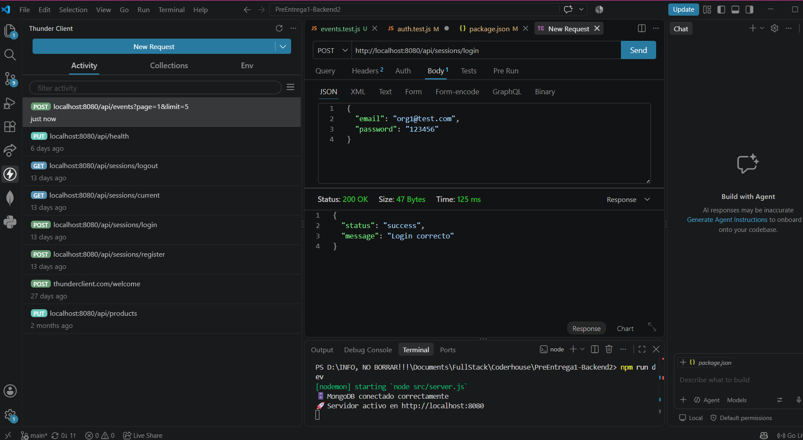

---

### 2. Creación exitosa de evento con rol `organizer` (201 Created)
Se crea el evento asignando automáticamente el ID del organizador autenticado:
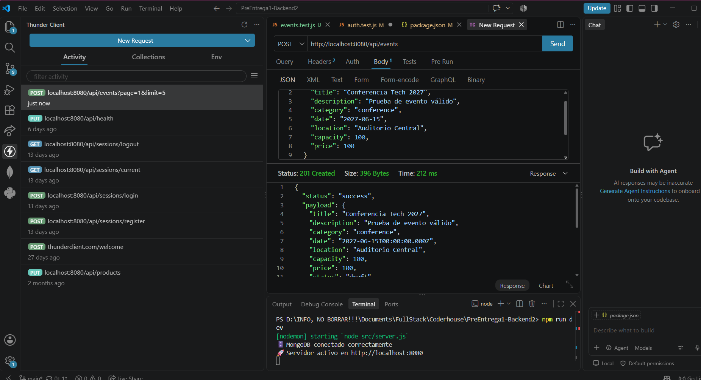

---

### 3. Validación de permisos: usuario con rol `user` intenta crear evento (403 Forbidden)
Middleware `authorize('organizer', 'admin')` bloquea la creación a usuarios estándar:


---

### 4. Regla de negocio: rechazo de eventos con fecha pasada (400 Bad Request)
La capa de servicios valida `new Date(date) > new Date()`:
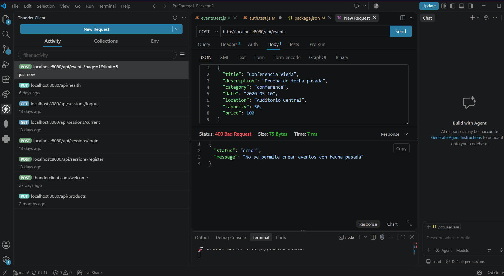

---

### 5. Regla de negocio: rechazo de capacidad menor o igual a cero (400 Bad Request)
La capa de servicios valida `capacity > 0`:
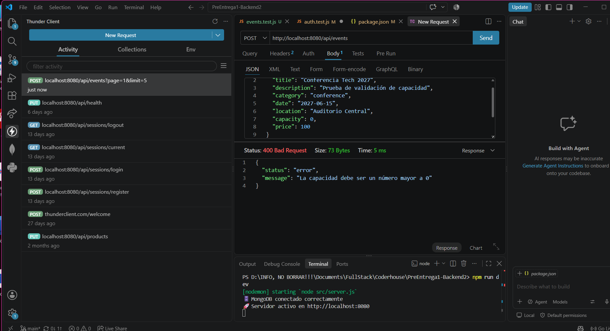

---

### 6. Listado público con filtros dinámicos y paginación (200 OK)
Consulta con parámetros combinados, paginación (`data`, `page`, `limit`, `total`, `totalPages`) y ordenamiento:
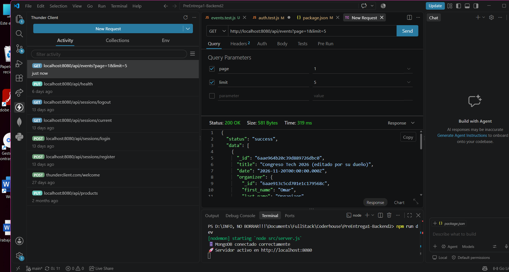

---

### 7. Consulta de evento inexistente (404 Not Found)
Consulta pública con un ID de formato válido pero que no existe en la base de datos:
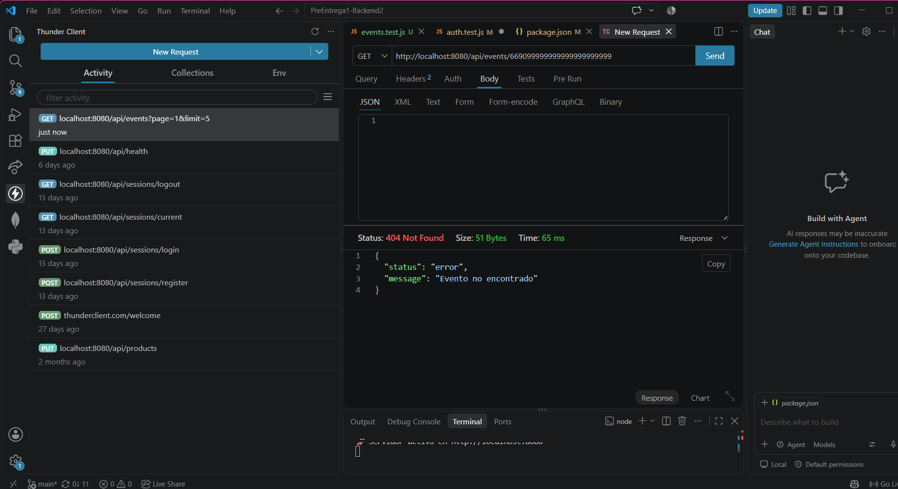

---

### 8. Modificación de evento propio por `organizer` (200 OK)
El organizador dueño del evento modifica exitosamente los campos permitidos:
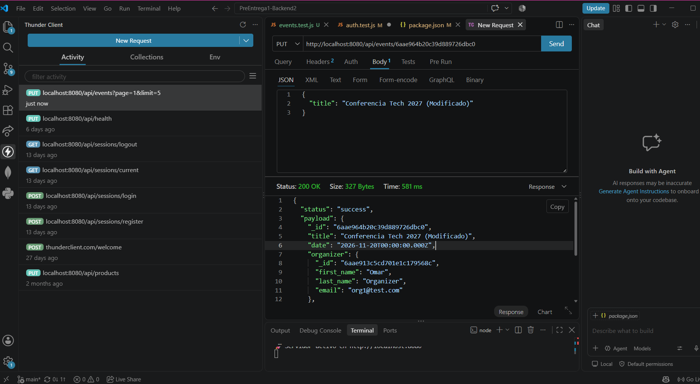

---

### 9. Control de propiedad: `organizer` intenta modificar evento ajeno (403 Forbidden)
El sistema compara el ID del organizador autenticado con el creador del evento y rechaza la modificación:
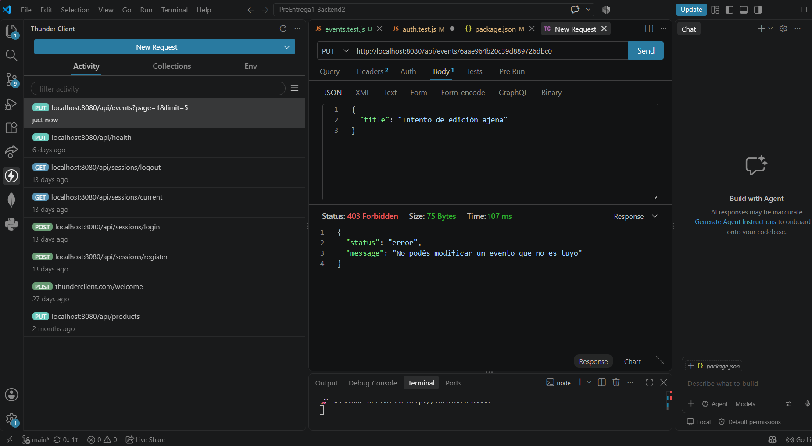

---

### 10. Permisos de administrador: `admin` modifica evento de cualquier organizador (200 OK)
El administrador puede actualizar cualquier evento preservando el `organizer` original:
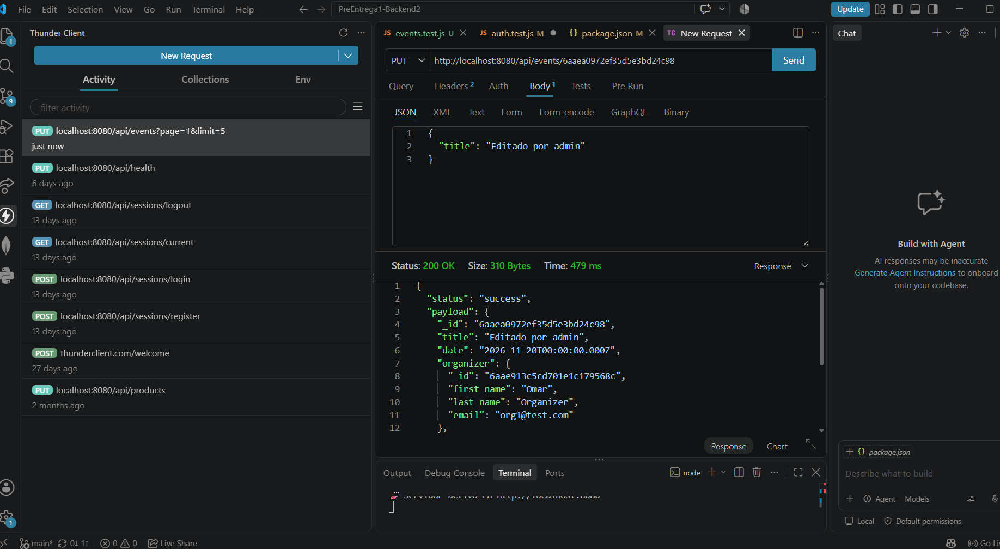

---

### 11. Cancelación lógica de evento por su organizador (200 OK)
El organizador cancela su evento transicionando su estado a `'cancelled'` mediante `PATCH /api/events/:id/status` (sin eliminación física en base de datos):
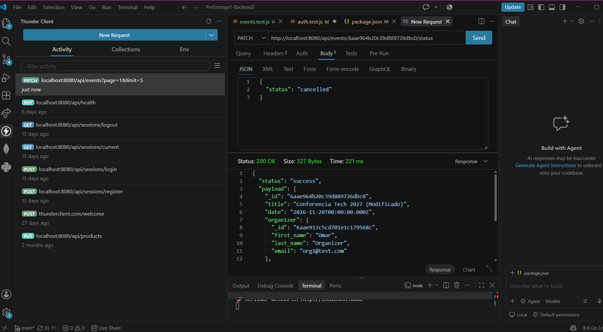

---

### 12. Regla de negocio: restricción de modificación sobre evento cancelado (400 Bad Request)
El servicio impide cambiar el estado de un evento que ya fue cancelado:
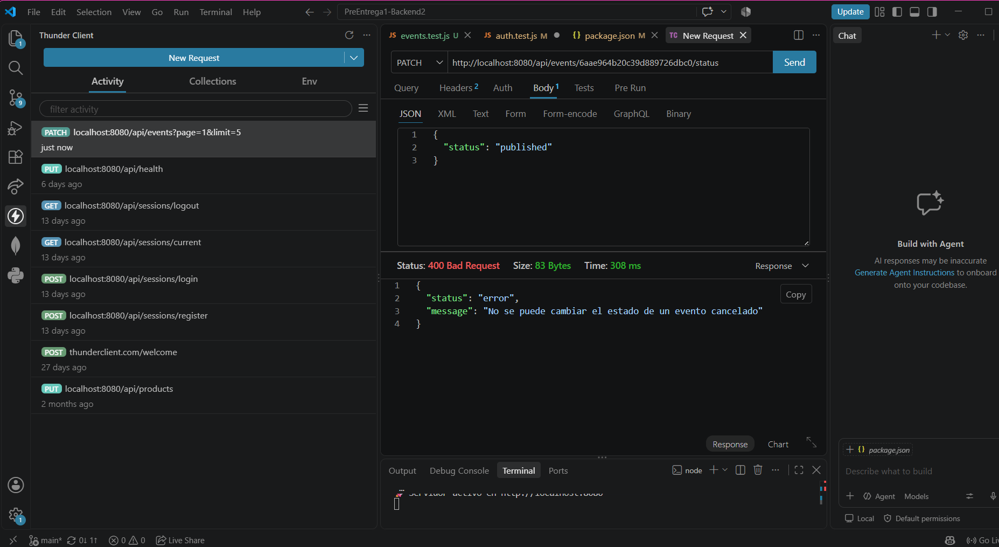

---

### 13. Protección de rutas sin cookie de sesión (401 Unauthorized)
Middleware `authenticate` responde 401 si no se envía la cookie con el token JWT:
