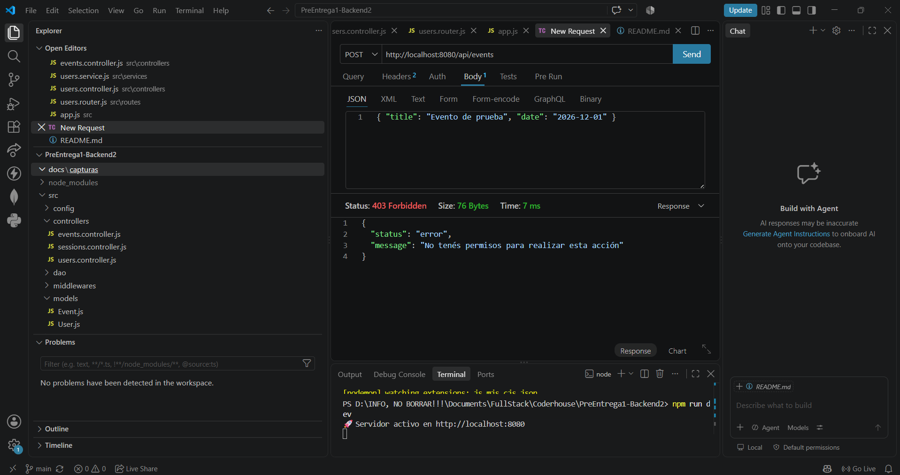
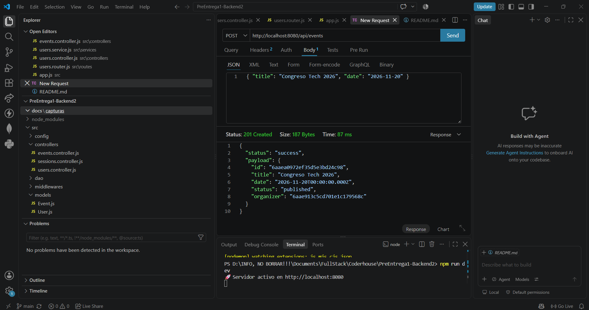
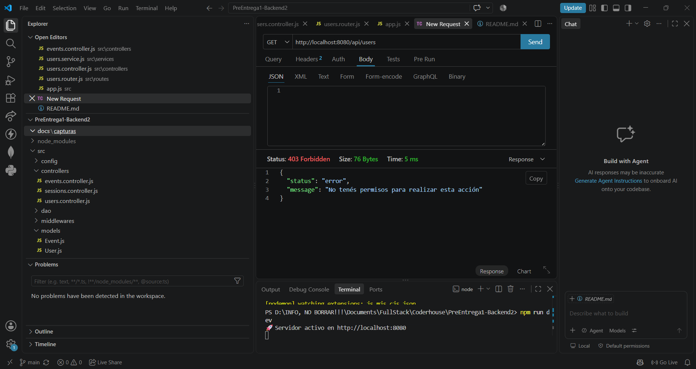
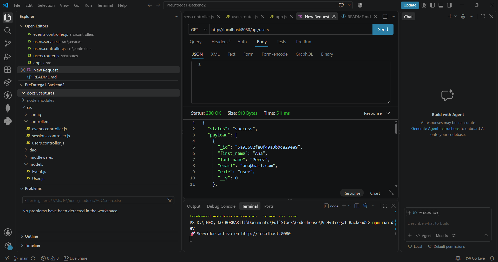
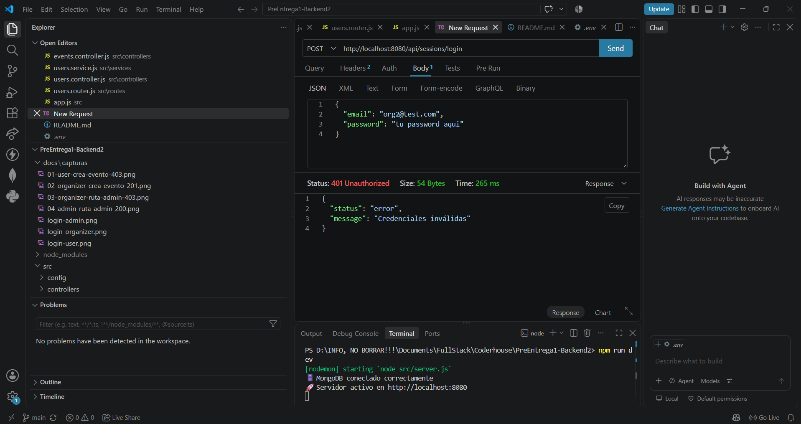
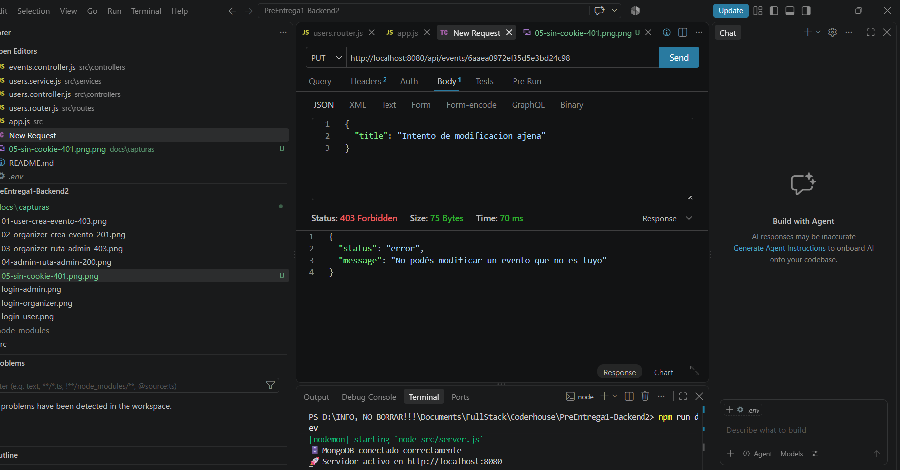

# Johana Aylén Parrello

# Plataforma de Eventos e Inscripciones

API REST desarrollada con Node.js y Express para la gestión de eventos e inscripciones, implementando una arquitectura profesional por capas (Router → Controller → Service → Repository → DAO → Modelo).

Este repositorio corresponde a la **Pre-entrega 5 de Backend II (Coderhouse): Roles y autorización**.
Incluye: arquitectura por capas, conexión a MongoDB con Mongoose, registro de usuarios con contraseñas hasheadas (bcrypt), autenticación centralizada con Passport.js (estrategias locales y JWT en cookies HttpOnly), ruta protegida `/current` y logout, y un sistema de **autorización por roles** (`user`, `organizer`, `admin`) con middlewares reutilizables, rutas protegidas, validación de propiedad de recursos y respuestas diferenciadas 401/403. La gestión de inscripciones a eventos queda para próximas entregas.

## Tecnologías

- Node.js
- Express
- Mongoose (MongoDB)
- Passport.js (`passport-local`, `passport-jwt`)
- JSON Web Token (`jsonwebtoken`)
- Bcrypt
- Cookie-parser
- Dotenv
- Nodemon (entorno de desarrollo)

## Arquitectura del proyecto

El proyecto sigue una separación en capas para aislar responsabilidades y facilitar el crecimiento del código en las próximas entregas:

- **Routes**: definen los endpoints HTTP, aplican los middlewares de autenticación y autorización y los conectan con su controller correspondiente. No contienen lógica.
- **Controllers**: reciben el `request` y el `response`. Se encargan de leer los datos de entrada y devolver la respuesta HTTP, delegando toda la lógica al service.
- **Services**: contienen la lógica de negocio de cada recurso (validaciones, reglas de dominio). Son el único punto de entrada que usan los controllers para operar sobre los datos.
- **Repositories**: capa intermedia entre el service y el DAO. Desacoplan la lógica de negocio de la implementación concreta de persistencia, de forma que el motor de base de datos se podría cambiar sin tocar los services.
- **DAO (Data Access Object)**: única capa que habla directamente con Mongoose/MongoDB. Contiene las operaciones CRUD puras contra cada modelo.
- **Models**: esquemas de Mongoose que definen la forma de los documentos en la base de datos.
- **Config**: configuración de la conexión a MongoDB (`db.config.js`, leída desde las variables de entorno) y de las estrategias de Passport (`passport.config.js`).
- **Middlewares**: funciones reutilizables, separadas del código de las rutas:
  - `auth.middleware.js` (`authenticate`): valida la sesión usando la estrategia `current` de Passport (JWT guardado en la cookie) y responde 401 si no hay sesión válida.
  - `authorize.middleware.js` (`authorize`): recibe los roles permitidos y responde 403 si el rol del usuario no coincide.
- **Utils**: funciones de soporte reutilizables. Incluye `hash.js` (hashing y comparación de contraseñas con bcrypt) y `jwt.js` (firma de JSON Web Tokens).

Flujo de una request protegida, por ejemplo `POST /api/events`:

```
Router (events.router.js)
  → authenticate (auth.middleware.js)        → 401 si no hay sesión
    → authorize('organizer', 'admin')        → 403 si el rol no alcanza
      → Controller (events.controller.js)
        → Service (events.service.js)
          → Repository (events.repository.js)
            → DAO (events.dao.js)
              → Modelo Mongoose (Event.js) → MongoDB
```

## Autenticación con Passport.js

El sistema centraliza todas las estrategias de autenticación en `src/config/passport.config.js`:

1. **Estrategia `'register'` (Local Strategy)**: valida obligatoriedad de campos, formato de email, longitud de contraseña (mínimo 6 caracteres), normaliza el email a minúsculas, hashea con bcrypt, verifica unicidad contra la base de datos y fuerza el rol por defecto `user`. La ruta delega limpiamente con `passport.authenticate('register')`.
2. **Estrategia `'login'` (Local Strategy)**: valida credenciales contra la base de datos. Si son inválidas, devuelve mensaje genérico (401). El controller es el responsable exclusivo de generar el JWT y guardarlo en la cookie `currentUser` HttpOnly.
3. **Estrategia `'current'` (JWT Strategy)**: lee y valida el JWT directamente desde la cookie `currentUser` mediante un extractor personalizado. Deja el payload del usuario (`{ id, email, role }`) disponible en `req.user`. Es la base del middleware `authenticate`, que protege las rutas respondiendo 401 si no hay token válido.
4. **Logout**: `POST /api/sessions/logout` limpia la cookie `currentUser` del cliente; no requiere pasar por Passport.

### Preparación para Providers Externos (OAuth)

La arquitectura está modularizada para que incorporar nuevos proveedores externos (como **Google OAuth** o **GitHub OAuth**) solo requiera registrar su respectiva estrategia dentro de `src/config/passport.config.js` (`passport.use('google', ...)` / `passport.use('github', ...)`), **sin necesidad de modificar `app.js` ni alterar la configuración global del servidor**.

## Roles y autorización

La API distingue entre **autenticación** (quién sos) y **autorización** (qué podés hacer). Cada acción se valida en el servidor mediante middlewares reutilizables, no en las rutas ni en la lógica de negocio.

### Roles

| Rol | Descripción |
|---|---|
| `user` | Rol por defecto. Solo consulta eventos publicados. |
| `organizer` | Crea eventos y gestiona los propios. |
| `admin` | Control total: modifica cualquier evento y ve todos los usuarios. |

El modelo `User` define el campo `role` con los valores `user`, `organizer` y `admin`, con `user` por defecto. El registro público (`POST /api/sessions/register`) **siempre** crea usuarios con rol `user`: cualquier `role` enviado en el body se ignora. Los roles `organizer` y `admin` se asignan directamente en la base de datos.

### Matriz de permisos

| Acción | user | organizer | admin |
|---|:---:|:---:|:---:|
| Consultar eventos publicados | ✅ | ✅ | ✅ |
| Crear eventos | ❌ | ✅ | ✅ |
| Modificar/cancelar eventos propios | ❌ | ✅ | ✅ |
| Modificar cualquier evento | ❌ | ❌ | ✅ |
| Ver todos los usuarios | ❌ | ❌ | ✅ |

### Middlewares

- `src/middlewares/auth.middleware.js` → `authenticate`: valida el JWT de la cookie mediante la estrategia `current` de Passport, deja al usuario en `req.user` y responde **401** si no hay sesión válida.
- `src/middlewares/authorize.middleware.js` → `authorize(...roles)`: recibe los roles permitidos, los compara con `req.user.role` y responde **403** si no coincide.

Se usan en cadena, siempre `authenticate` primero:

```js
router.post('/', authenticate, authorize('organizer', 'admin'), createEvent);
```

### Propiedad de recursos

Cada evento guarda su `organizer` (el `id` del usuario que lo creó, tomado siempre de la sesión y nunca del body). En `PUT /api/events/:id`, un `organizer` solo puede modificar eventos cuyo `organizer` coincida con su `id`; un `admin` puede modificar cualquiera. Si un organizer intenta modificar un evento ajeno, recibe **403**.

### Diferencia entre 401 y 403

| Código | Significa | Ejemplo |
|---|---|---|
| **401 Unauthorized** | No hay sesión válida: el servidor no sabe quién sos. | Pedir `GET /api/users` sin cookie. |
| **403 Forbidden** | Hay sesión válida, pero tu rol no tiene permiso. | Un `user` intentando `POST /api/events`. |

Ejemplos de respuesta:

```json
// 401
{ "status": "error", "message": "No autenticado" }

// 403
{ "status": "error", "message": "No tenés permisos para realizar esta acción" }
```

## Instalación

1. Clonar el repositorio.
2. Ejecutar `npm install` para instalar las dependencias.
3. Crear un archivo `.env` en la raíz del proyecto basándose en `.env.example`.

## Variables de entorno

| Variable         | Descripción                                        |
|------------------|-----------------------------------------------------|
| `PORT`           | Puerto donde se levanta el servidor                 |
| `NODE_ENV`       | Entorno de ejecución (`development`/`production`)  |
| `MONGO_URL`      | Cadena de conexión a la base de datos MongoDB       |
| `JWT_SECRET`     | Secreto usado para firmar y verificar los JWT       |
| `JWT_EXPIRES_IN` | Tiempo de expiración del JWT (ej: `1h`)             |

## Ejecución

- Modo desarrollo (con recarga automática): `npm run dev`
- Modo producción: `npm start`

Al iniciar, el servidor se conecta primero a MongoDB (usando `MONGO_URL`) y recién después empieza a escuchar peticiones. Si la conexión falla, el proceso se detiene y muestra el error en consola.

## Estructura de carpetas

```
src/
├── app.js                       # Configura Express (middlewares, rutas). No levanta el server.
├── server.js                    # Conecta a MongoDB y levanta el servidor.
├── config/
│   ├── db.config.js             # Conexión a MongoDB con Mongoose.
│   └── passport.config.js       # Estrategias centralizadas de Passport.
├── routes/
│   ├── events.router.js
│   ├── sessions.router.js
│   └── users.router.js
├── controllers/
│   ├── events.controller.js
│   ├── sessions.controller.js
│   └── users.controller.js
├── services/
│   ├── events.service.js
│   ├── sessions.service.js
│   └── users.service.js
├── repositories/
│   ├── events.repository.js
│   └── users.repository.js
├── dao/
│   ├── events.dao.js
│   └── users.dao.js
├── models/
│   ├── Event.js
│   └── User.js
├── middlewares/
│   ├── auth.middleware.js       # authenticate → 401 si no hay sesión
│   └── authorize.middleware.js  # authorize(...roles) → 403 si el rol no coincide
└── utils/
    ├── hash.js
    └── jwt.js
```

## Rutas disponibles

| Método | Ruta                     | Acceso                                                | Descripción                                          |
|--------|--------------------------|-------------------------------------------------------|-------------------------------------------------------|
| GET    | `/api/health`            | Público                                               | Comprobación del estado del servidor                  |
| POST   | `/api/sessions/register` | Público                                               | Registro de usuarios                                  |
| POST   | `/api/sessions/login`    | Público                                               | Login: valida credenciales y setea cookie de sesión   |
| GET    | `/api/sessions/current`  | Autenticados                                          | Devuelve el usuario autenticado (ruta protegida)      |
| POST   | `/api/sessions/logout`   | Público                                               | Cierra la sesión eliminando la cookie                 |
| GET    | `/api/events`            | Autenticados                                          | Listado de eventos publicados                         |
| POST   | `/api/events`            | `organizer`, `admin`                                  | Creación de eventos                                   |
| PUT    | `/api/events/:id`        | `organizer` (solo sus eventos), `admin` (cualquiera)  | Modificación o cancelación de eventos                 |
| GET    | `/api/users`             | `admin`                                               | Listado de todos los usuarios (ruta administrativa)   |

## POST /api/sessions/register

Registra un nuevo usuario. La contraseña se guarda hasheada con bcrypt y nunca se devuelve en la respuesta. El campo `role` siempre se fuerza a `user`, sin importar lo que venga en el body.

**Body esperado (JSON):**

| Campo | Tipo | Obligatorio |
|---|---|---|
| first_name | string | Sí |
| last_name | string | Sí |
| email | string | Sí (formato válido, se normaliza a minúsculas) |
| password | string | Sí (mínimo 6 caracteres) |

**Ejemplo de request:**

```json
{
  "first_name": "Ana",
  "last_name": "Pérez",
  "email": "Ana@Mail.com",
  "password": "Secreta123"
}
```

**Respuesta 201 (éxito):**

```json
{
  "status": "success",
  "payload": {
    "id": "665f2a...",
    "first_name": "Ana",
    "last_name": "Pérez",
    "email": "ana@mail.com",
    "role": "user"
  }
}
```

**Cómo probarlo:**
1. Levantar el servidor: `npm run dev`
2. Hacer `POST http://localhost:8080/api/sessions/register` con el body de ejemplo.
3. Repetir la misma request: debe responder 409 (email duplicado).
4. Probar sin `password` o con un email sin `@`: debe responder 400.

## POST /api/sessions/login

Valida el email y la contraseña. Si son correctos, genera un JWT con `{ id, email, role }` y lo guarda en una cookie `currentUser` (`httpOnly`, `sameSite: 'lax'`, expiración de 1 hora, `secure` solo en producción). El token nunca se devuelve en el body. Si el email no existe o la contraseña no coincide, responde siempre el mismo mensaje genérico, sin indicar cuál de los dos falló.

**Body esperado (JSON):**

| Campo | Tipo | Obligatorio |
|---|---|---|
| email | string | Sí |
| password | string | Sí |

**Ejemplo de request:**

```json
{
  "email": "ana@mail.com",
  "password": "Secreta123"
}
```

**Respuesta 200 (éxito, además setea la cookie `currentUser`):**

```json
{
  "status": "success",
  "message": "Login correcto"
}
```

**Respuesta 401 (credenciales incorrectas):**

```json
{
  "status": "error",
  "message": "Credenciales inválidas"
}
```

**Cómo probarlo:**
1. Registrar un usuario con `POST /api/sessions/register`.
2. Hacer `POST http://localhost:8080/api/sessions/login` con ese email y password.
3. Verificar que la respuesta trae la cookie `currentUser`.
4. Probar con un email inexistente y con un password incorrecto: ambos deben responder 401 con el mismo mensaje.

> **Importante:** el rol viaja dentro del token. Si se cambia el `role` de un usuario en la base de datos, hay que volver a hacer login para que el token nuevo lo incluya.

## GET /api/sessions/current

Ruta protegida con el middleware `authenticate`. La estrategia 'current' de Passport lee la cookie `currentUser`, verifica el JWT y, si es válido, guarda el payload en `req.user`. Devuelve los datos del usuario autenticado sin el password.

**Respuesta 200 (con cookie válida):**

```json
{
  "status": "success",
  "payload": {
    "id": "665f2a...",
    "email": "ana@mail.com",
    "role": "user"
  }
}
```

**Respuesta 401 (sin cookie, o token inválido/expirado):**

```json
{
  "status": "error",
  "message": "No autenticado"
}
```

**Cómo probarlo:**
1. Hacer login primero para obtener la cookie.
2. Hacer `GET http://localhost:8080/api/sessions/current` (la cookie viaja automáticamente en la misma sesión de Thunder Client/Postman).
3. Repetir la request sin la cookie, o modificando el token: debe responder 401.

## POST /api/sessions/logout

Elimina la cookie `currentUser`, cerrando la sesión.

**Respuesta 200:**

```json
{
  "status": "success",
  "message": "Sesión cerrada"
}
```

**Cómo probarlo:**
1. Hacer login para tener la cookie activa.
2. Hacer `POST http://localhost:8080/api/sessions/logout`.
3. Repetir `GET /api/sessions/current`: debe responder 401, confirmando que la sesión quedó cerrada.

## GET /api/events

Ruta protegida (`authenticate`). Devuelve los eventos publicados; los eventos cancelados no se listan. Disponible para `user`, `organizer` y `admin`.

**Respuesta 200:**

```json
{
  "status": "success",
  "payload": [
    {
      "_id": "6690...",
      "title": "Congreso Tech 2026",
      "date": "2026-11-20T00:00:00.000Z",
      "organizer": "665f2a...",
      "status": "published"
    }
  ]
}
```

**Respuesta 401 (sin cookie):**

```json
{
  "status": "error",
  "message": "No autenticado"
}
```

**Cómo probarlo:**
1. Hacer login con cualquier usuario.
2. Hacer `GET http://localhost:8080/api/events`: debe responder 200 con la lista de eventos publicados.
3. Hacer logout y repetir la request: debe responder 401.

## POST /api/events

Crea un evento. Solo `organizer` y `admin` (`authenticate` + `authorize('organizer', 'admin')`). El campo `organizer` se toma del usuario autenticado, nunca del body.

**Body esperado (JSON):**

| Campo | Tipo | Obligatorio |
|---|---|---|
| title | string | Sí |
| date | string (fecha) | Sí |

**Ejemplo de request:**

```json
{
  "title": "Congreso Tech 2026",
  "date": "2026-11-20"
}
```

**Respuesta 201 (organizer o admin):**

```json
{
  "status": "success",
  "payload": {
    "id": "6690...",
    "title": "Congreso Tech 2026",
    "date": "2026-11-20T00:00:00.000Z",
    "status": "published",
    "organizer": "665f2a..."
  }
}
```

**Respuesta 403 (rol `user`):**

```json
{
  "status": "error",
  "message": "No tenés permisos para realizar esta acción"
}
```

**Respuesta 401 (sin cookie):**

```json
{
  "status": "error",
  "message": "No autenticado"
}
```

**Cómo probarlo:**
1. Hacer login con un usuario de rol `user` y enviar el body de ejemplo: debe responder 403.
2. Hacer login con un usuario de rol `organizer` (o `admin`) y repetir la request: debe responder 201, con el `organizer` igual al `id` del usuario logueado.
3. Hacer logout y repetir la request: debe responder 401.
4. Enviar el body sin `title` o sin `date` (con un organizer logueado): debe responder 400.

## PUT /api/events/:id

Modifica un evento. Solo `organizer` y `admin`, con validación de propiedad: un `organizer` solo puede modificar los eventos que creó; un `admin` puede modificar cualquiera. Se pueden actualizar `title`, `date` y `status` (`published` o `cancelled`); el `organizer` del evento nunca cambia.

**Ejemplo de request:**

```json
{
  "title": "Congreso Tech 2026 (edición actualizada)"
}
```

**Respuestas:**

| Código | Situación |
|---|---|
| 200 | Evento actualizado (dueño o admin) |
| 400 | ID de evento inválido |
| 401 | Sin sesión |
| 403 | Rol `user`, o `organizer` intentando modificar un evento ajeno |
| 404 | Evento no encontrado |

**Respuesta 403 (organizer con evento ajeno):**

```json
{
  "status": "error",
  "message": "No podés modificar un evento que no es tuyo"
}
```

**Cómo probarlo:**
1. Hacer login con un `organizer` (org1), crear un evento con `POST /api/events` y copiar su `id`.
2. Con org1 hacer `PUT http://localhost:8080/api/events/<id>` con el body de ejemplo: debe responder 200.
3. Hacer login con otro `organizer` (org2) y repetir el `PUT` sobre el mismo `id`: debe responder 403.
4. Hacer login con un `admin` y repetir el `PUT` sobre el mismo `id`: debe responder 200, y el `organizer` del evento sigue siendo org1.
5. Probar con un `id` que no tenga formato válido (por ejemplo `123`): debe responder 400.

## GET /api/users

Ruta administrativa. Solo `admin` (`authenticate` + `authorize('admin')`). Devuelve todos los usuarios **sin el campo `password`**.

**Respuesta 200 (admin):**

```json
{
  "status": "success",
  "payload": [
    {
      "_id": "665f2a...",
      "first_name": "Ana",
      "last_name": "Pérez",
      "email": "ana@mail.com",
      "role": "user"
    }
  ]
}
```

**Respuesta 403 (organizer o user):**

```json
{
  "status": "error",
  "message": "No tenés permisos para realizar esta acción"
}
```

**Cómo probarlo:**
1. Hacer login con un `organizer` y pedir `GET http://localhost:8080/api/users`: debe responder 403.
2. Hacer login con un `admin` y repetir la request: debe responder 200, con la lista de usuarios sin el campo `password`.
3. Hacer logout y repetir la request: debe responder 401.

## Cómo probar los roles

Como el registro público solo crea usuarios `user`, para probar los demás roles:

1. Registrar cuatro usuarios con `POST /api/sessions/register` (por ejemplo `user@test.com`, `org1@test.com`, `org2@test.com` y `admin@test.com`).
2. En la base de datos (colección `users`), cambiar el campo `role` de `org1` y `org2` a `organizer`, y el de `admin` a `admin`.
3. Antes de cada prueba, hacer login con el usuario que corresponda (el login reemplaza la cookie anterior).

## Casos probados

| # | Caso | Resultado esperado | Resultado |
|---|---|---|---|
| 1 | `POST /api/events` con rol `user` | 403 | ✅ |
| 2 | `POST /api/events` con rol `organizer` | 201 | ✅ |
| 3 | `GET /api/users` con rol `organizer` | 403 | ✅ |
| 4 | `GET /api/users` con rol `admin` | 200 (sin `password`) | ✅ |
| 5 | Ruta privada sin cookie | 401 | ✅ |
| 6 | `organizer` modificando un evento ajeno | 403 | ✅ |
| Extra | `admin` modificando el evento de un organizer | 200 | ✅ |
| Extra | `organizer` modificando su propio evento | 200 | ✅ |

## Evidencia

Capturas de las pruebas realizadas con Thunder Client (carpeta `docs/capturas/`):

**1. `POST /api/events` con rol `user` → 403**



**2. `POST /api/events` con rol `organizer` → 201**



**3. `GET /api/users` con rol `organizer` → 403**



**4. `GET /api/users` con rol `admin` → 200**



**5. Ruta privada sin cookie → 401**



**6. `organizer` modificando un evento ajeno → 403**

