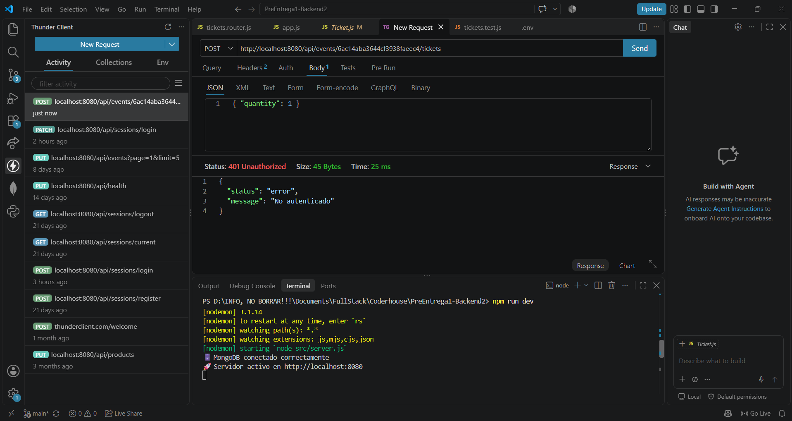
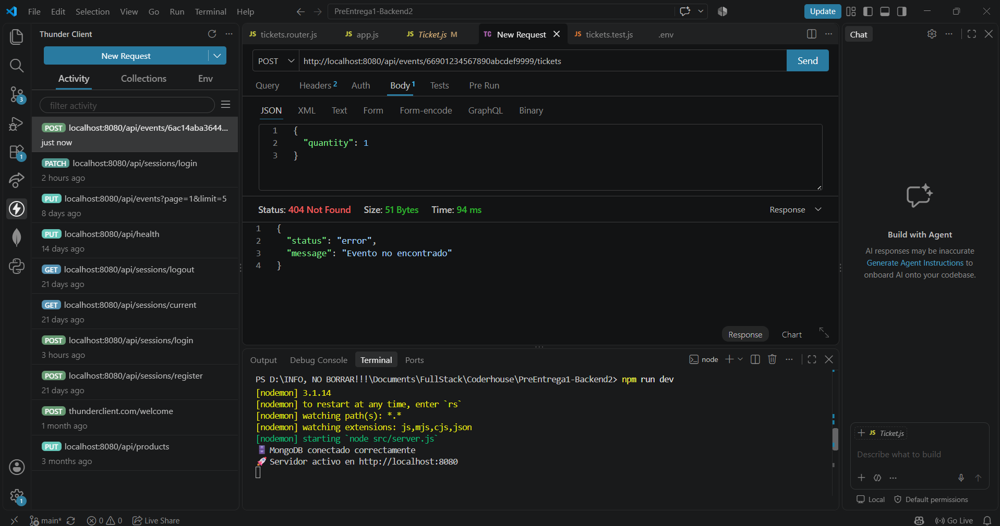
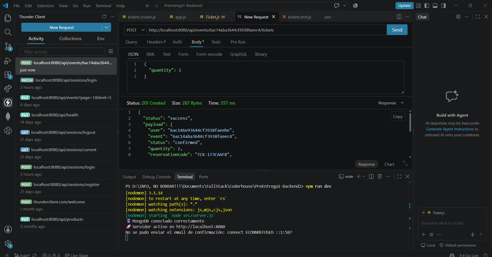
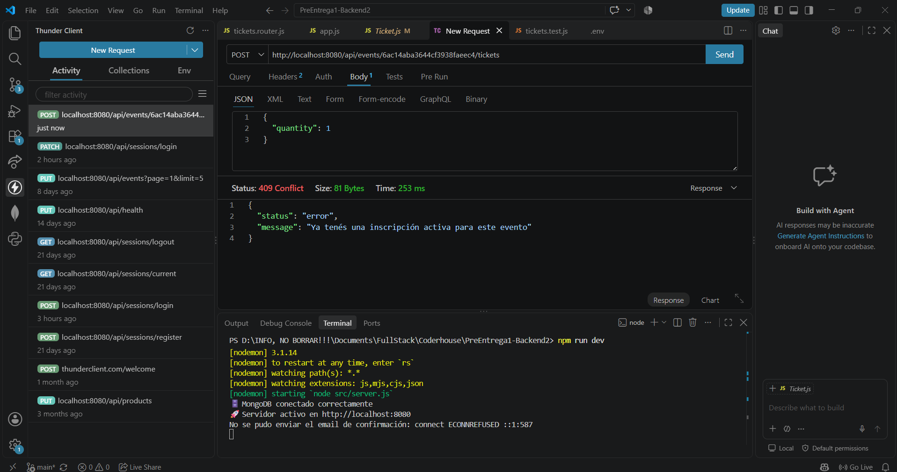
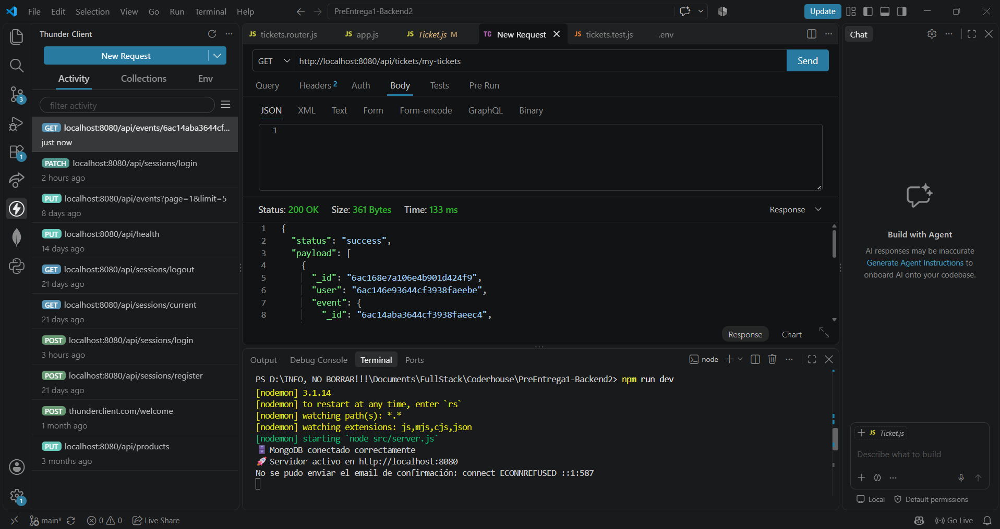
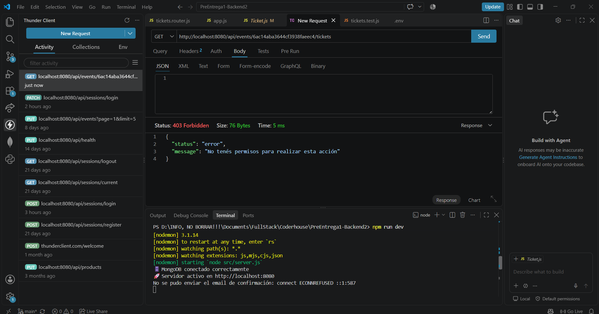
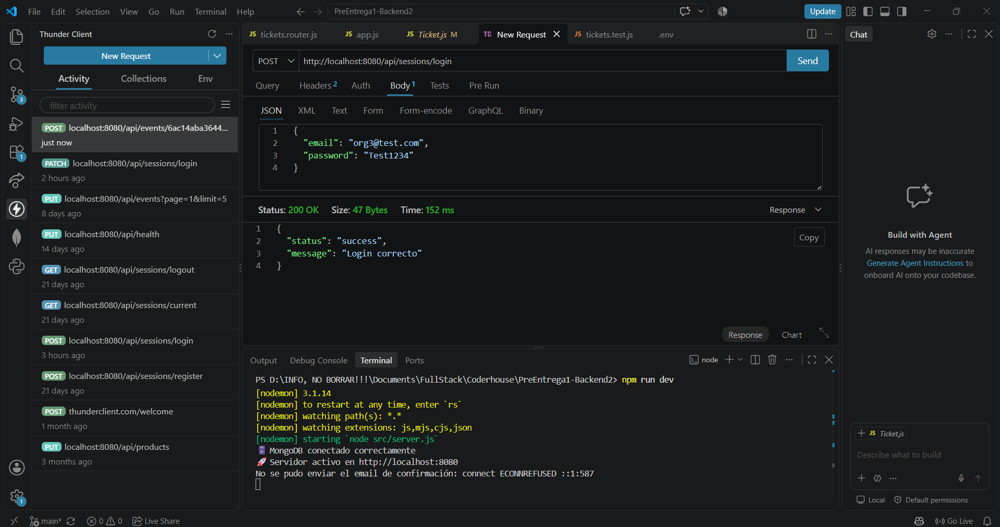
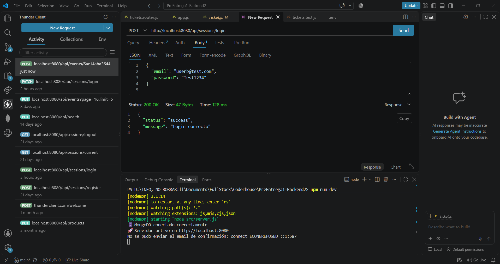
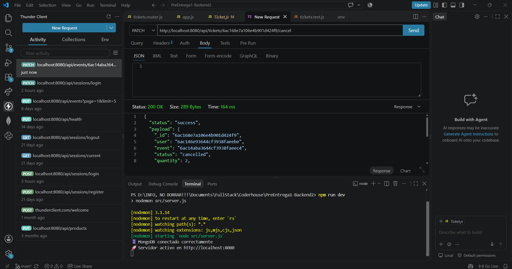

# Johana Aylén Parrello

# Plataforma de Eventos e Inscripciones

API REST desarrollada con Node.js y Express para la gestión integral de eventos, venta/reserva de tickets e inscripciones con control de cupos, implementando una arquitectura profesional por capas (**Router → Controller → Service → Repository → DAO → Modelo**).

Este repositorio corresponde a la **Pre-entrega 7 de Backend II (Coderhouse): Tickets, inscripciones y control de cupos**.

---

## Características de la Pre-entrega 7

- **Entidad `Ticket` (Modelo Mongoose)**:
  - Relación limpia sin objetos embebidos: referencias `ObjectId` a `user` (`ref: 'User'`) y `event` (`ref: 'Event'`).
  - Control de estados estricto vía enum: `confirmed`, `pending`, `cancelled`.
  - Campos de auditoría y trazabilidad: `quantity`, `reservationCode` único (alfanumérico `TCK-XXXXXXXX`), `createdAt` y `cancelledAt`.
- **Lógica de negocio en la capa de servicios (`src/services/tickets.service.js`)**:
  - Toda la validación reside en el servicio (el controlador solo recibe y delega).
  - Verificación de existencia del evento y formato de ID.
  - Validación de estado: solo eventos en estado `published` (se rechazan eventos `draft`, `cancelled` o `finished`/fecha pasada).
  - Validación de cantidad: número entero positivo (`quantity > 0`).
  - **Control estricto de cupos**: cálculo dinámico de lugares ocupados sumando la cantidad de tickets activos (`confirmed` y `pending`) mediante agregación en MongoDB. Los tickets `cancelled` no ocupan cupo. Si la cantidad solicitada supera los cupos disponibles, responde con error `409 Conflict` y mensaje claro indicando los lugares restantes.
  - **Prevención de duplicados**: un usuario no puede registrar dos inscripciones activas simultáneas para el mismo evento. Si el usuario canceló una inscripción previa, el sistema le permite volver a inscribirse.
- **Cancelación lógica y liberación inmediata de cupos**:
  - Transición a `cancelled` y registro de fecha en `cancelledAt` sin borrado físico en base de datos.
  - Al no computar los tickets cancelados en la agregación, el cupo queda liberado automáticamente para nuevos asistentes.
  - Control de propiedad: únicamente el usuario dueño del ticket o un administrador (`admin`) pueden cancelarlo (403 Forbidden para terceros).
- **Consulta de tickets propios (`/api/tickets/my-tickets`)**:
  - Retorna las inscripciones del usuario autenticado.
  - Aplica `populate` en el campo `event` trayendo únicamente datos seguros: `title`, `date` y `location`.
  - No expone datos de otros usuarios ni información sensible.
- **Consulta de inscriptos por evento (`/api/events/:eid/tickets`)**:
  - Restringido únicamente al organizador dueño de dicho evento o a un `admin` (403 Forbidden para usuarios comunes o para otros organizadores).
  - Aplica `populate` en `user` mostrando `first_name`, `last_name` y `email`.
- **Notificaciones automáticas con Nodemailer**:
  - Al confirmarse una inscripción exitosa, se envía un correo electrónico de confirmación con los datos del evento, cantidad de lugares y código de reserva.
  - Manejo resiliente: si el servicio de correo experimenta fallas temporales, el ticket se registra correctamente garantizando la persistencia de la inscripción.
  - Credenciales seguras: parametrizadas 100% en variables de entorno (`MAIL_HOST`, `MAIL_PORT`, `MAIL_USER`, `MAIL_PASS`, `MAIL_FROM`), sin ningún dato hardcodeado en el código fuente.
- **Suite de tests automatizados (Jest + Supertest)**:
  - **39 tests pasando al 100%** cubriendo autenticación, roles, eventos y el flujo completo de tickets (casos de éxito, control de cupos, duplicados, cancelaciones, populate y errores 400, 401, 403, 404, 409).

---

## Tecnologías

- **Node.js** (v18+)
- **Express** (v4)
- **Mongoose** (MongoDB ODM)
- **Nodemailer** (servicio de notificaciones por email)
- **Passport.js** (`passport-local`, `passport-jwt`)
- **JSON Web Token** (`jsonwebtoken`)
- **Bcrypt** (hashing de contraseñas)
- **Cookie-parser** (manejo de cookies `HttpOnly`)
- **Dotenv** (gestión de variables de entorno)
- **Jest** y **Supertest** (tests automatizados de integración y servicios)
- **Cross-env** (compatibilidad multiplataforma en scripts de testing)
- **Nodemon** (entorno de desarrollo)

---

## Arquitectura del proyecto

El proyecto implementa una arquitectura desacoplada por capas:

```
Petición HTTP
      │
      ▼
┌──────────────┐
│    Router    │ ── Rutas y middlewares (authenticate, authorize).
└──────────────┘
      │
      ▼
┌──────────────┐
│  Controller  │ ── Parsea params, query, body y formatea respuesta HTTP.
└──────────────┘
      │
      ▼
┌──────────────┐
│   Service    │ ── Reglas de negocio puras, validación de cupos, permisos y mailer.
└──────────────┘
      │
      ▼
┌──────────────┐
│  Repository  │ ── Abstracción de acceso a datos para desacoplar el dominio.
└──────────────┘
      │
      ▼
┌──────────────┐
│     DAO      │ ── Data Access Object: consultas y agregaciones en MongoDB.
└──────────────┘
      │
      ▼
┌──────────────┐
│ Modelo Mongo │ ── Esquemas Mongoose (User, Event, Ticket).
└──────────────┘
```

### Estructura de carpetas

```
PreEntrega1-Backend2/
├── docs/
│   └── capturas/                   # Evidencia de pruebas de endpoints
├── src/
│   ├── config/
│   │   ├── db.config.js            # Conexión a MongoDB Atlas
│   │   └── passport.config.js      # Estrategias JWT y Local
│   ├── controllers/
│   │   ├── events.controller.js
│   │   ├── sessions.controller.js
│   │   ├── tickets.controller.js   # Controlador de inscripciones y tickets
│   │   └── users.controller.js
│   ├── dao/
│   │   ├── events.dao.js
│   │   ├── tickets.dao.js          # Agregaciones de cupos y consultas Mongoose
│   │   └── users.dao.js
│   ├── middlewares/
│   │   ├── auth.middleware.js      # authenticate (401 si no hay sesión)
│   │   └── authorize.middleware.js # authorize(...roles) (403 si no tiene rol)
│   ├── models/
│   │   ├── Event.js                # Modelo de Evento
│   │   ├── Ticket.js               # Modelo de Ticket/Inscripción
│   │   └── User.js                 # Modelo de Usuario
│   ├── repositories/
│   │   ├── events.repository.js
│   │   ├── tickets.repository.js
│   │   └── users.repository.js
│   ├── routes/
│   │   ├── events.router.js
│   │   ├── sessions.router.js
│   │   ├── tickets.router.js       # Endpoints de tickets e inscripciones
│   │   └── users.router.js
│   ├── services/
│   │   ├── events.service.js       # Reglas de negocio de eventos
│   │   ├── sessions.service.js
│   │   ├── tickets.service.js      # Validación de cupos, duplicados y cancelación
│   │   └── users.service.js
│   ├── utils/
│   │   ├── hash.js                 # Hashing de passwords con bcrypt
│   │   ├── jwt.js                  # Generación y validación de tokens
│   │   └── mailer.js               # Transporte Nodemailer para confirmaciones
│   ├── app.js                      # Configuración de Express y middlewares
│   └── server.js                   # Arranque del servidor HTTP
├── tests/
│   ├── auth.test.js                # Tests de autenticación y roles (Pre-entrega 5)
│   ├── events.test.js              # Tests de negocio de eventos (Pre-entrega 6)
│   └── tickets.test.js             # Tests de inscripciones, cupos y tickets (Pre-entrega 7)
├── .env.example                    # Plantilla de variables de entorno (con MAIL_*)
├── .gitignore                      # Exclusión de node_modules y .env
├── package.json
└── README.md
```

---

## Modelo `Ticket` (`src/models/Ticket.js`)

Esquema de Mongoose para la colección `tickets`:

| Campo | Tipo | Requerido | Valor por defecto | Reglas y Restricciones |
|---|---|:---:|:---:|---|
| `user` | `ObjectId` | Sí | - | Referencia a `User` (`ref: 'User'`). Solo ID, sin objeto embebido. |
| `event` | `ObjectId` | Sí | - | Referencia a `Event` (`ref: 'Event'`). Solo ID, sin objeto embebido. |
| `status` | `String` | No | `'confirmed'` | Enum estricto: `['confirmed', 'pending', 'cancelled']`. |
| `quantity` | `Number` | Sí | - | Cantidad de cupos reservados (`min: 1`, entero positivo). |
| `reservationCode` | `String` | Sí | - | Código único autogenerado con formato `TCK-XXXXXXXX` (`unique: true`). |
| `createdAt` | `Date` | No | `Date.now` | Fecha y hora en que se confirmó la inscripción. |
| `cancelledAt` | `Date` | No | `null` | Fecha en que fue cancelado (permanece `null` si está activo). |

### Índices optimizados
- `{ event: 1, status: 1 }`: acelera el cálculo de agregación de cupos y búsqueda de inscritos.
- `{ user: 1 }`: optimiza la consulta de "mis tickets".

---

## Reglas de Negocio de Tickets (`src/services/tickets.service.js`)

Toda la lógica de control de negocio se ejecuta en la capa de servicios:

### 1. Flujo de Inscripción (`createTicket`)
Cuando un usuario autenticado intenta inscribirse en `POST /api/events/:eid/tickets`:
1. **Existencia del Evento**: valida que el `eid` sea un `ObjectId` válido y que exista en base de datos (responde `404 Not Found` si no existe).
2. **Estado del Evento**:
   - Si `event.status === 'cancelled'` → responde `400 Bad Request` ("El evento está cancelado").
   - Si `event.status === 'finished'` o la fecha del evento ya pasó → responde `400 Bad Request` ("El evento ya finalizó").
   - Si `event.status !== 'published'` (por ejemplo, `'draft'`) → responde `400 Bad Request` ("El evento no está publicado").
3. **Validación de Cantidad**: `quantity` debe ser un entero positivo mayor a 0 (de lo contrario responde `400 Bad Request`).
4. **Control y Cálculo de Cupos**:
   - Se calcula la cantidad de lugares ya ocupados mediante agregación en MongoDB:
     `cuposOcupados = sum(quantity de tickets con status 'confirmed' o 'pending')`
   - Los tickets con status `'cancelled'` **NO** se suman.
   - Si `quantity > (event.capacity - cuposOcupados)`: se cancela la operación y responde `409 Conflict` con el mensaje:
     `"No hay cupos suficientes. Lugares disponibles: X"`
5. **Prevención de Inscripciones Duplicadas**:
   - Se verifica si el usuario autenticado ya posee un ticket activo (`confirmed` o `pending`) para ese mismo evento.
   - Si existe, responde `409 Conflict`: `"Ya tenés una inscripción activa para este evento"`.
   - Si el usuario tenía un ticket anterior pero fue cancelado, la validación lo permite normalmente.
6. **Persistencia**: se crea el ticket guardando únicamente las referencias (`user: user.id`, `event: eventId`), status `'confirmed'` y un `reservationCode` único.
7. **Notificación por Correo**: se invoca a `sendTicketConfirmation` mediante Nodemailer enviando el detalle de la reserva al email del usuario. Si el servidor SMTP falla, la inscripción no se revierte y retorna `201 Created` exitosamente.

---

### 2. Cancelación Lógica y Liberación de Cupos (`cancelTicket`)
Cuando se invoca `PATCH /api/tickets/:tid/cancel`:
1. **Validación del Ticket**: si el ID no existe o no tiene formato válido, responde `404 Not Found`.
2. **Control de Propiedad**: se verifica que el solicitante sea el dueño del ticket (`String(ticket.user) === String(user.id)`) o tenga rol `admin`. Si un usuario común intenta cancelar el ticket de otra persona, responde `403 Forbidden` ("No podés cancelar un ticket que no es tuyo").
3. **Estado Previo**: si el ticket ya se encuentra en `'cancelled'`, responde `400 Bad Request` ("El ticket ya está cancelado").
4. **Baja Lógica**: se actualiza el ticket con `status: 'cancelled'` y `cancelledAt: new Date()`. **En ningún caso se elimina físicamente de la base de datos**.
5. **Liberación de Cupo**: al quedar con status `cancelled`, la siguiente consulta de cupos disponibles ya no computa este ticket, liberando inmediatamente los lugares para nuevos usuarios.

---

### 3. Consulta de Mis Tickets (`getMyTickets`)
Endpoint `GET /api/tickets/my-tickets`:
- Solo responde con los tickets del usuario autenticado (`user.id`).
- Aplica `populate('event', 'title date location')` para mostrar datos del evento sin exponer información innecesaria.
- No expone datos de otros usuarios ni del organizador.

---

### 4. Consulta de Inscriptos por Evento (`getEventTickets`)
Endpoint `GET /api/events/:eid/tickets`:
- **Permisos requeridos**: rol `organizer` o `admin`.
- **Verificación de pertenencia**: si el rol es `organizer`, el sistema valida que sea el creador del evento (`event.organizer === user.id`). Si intenta ver inscriptos de un evento de otro organizador, responde `403 Forbidden` ("Solo podés ver los tickets de tus propios eventos").
- Si el rol es `admin`, tiene acceso a ver los tickets de cualquier evento.
- Aplica `populate('user', 'first_name last_name email')` para que el organizador pueda gestionar la lista de asistentes.

---

## Matriz Completa de Endpoints

### Sesiones y Usuarios
| Método | Endpoint | Acceso | Descripción |
|---|---|---|---|
| `POST` | `/api/sessions/register` | Público | Registro de usuario (asigna rol `user` por defecto). |
| `POST` | `/api/sessions/login` | Público | Inicio de sesión, devuelve cookie `currentUser` con JWT. |
| `GET` | `/api/sessions/current` | Autenticado | Datos del usuario autenticado. |
| `POST` | `/api/sessions/logout` | Público | Cierre de sesión, limpia la cookie. |
| `GET` | `/api/users` | Admin | Listado de todos los usuarios registrados. |

### Eventos
| Método | Endpoint | Acceso | Descripción |
|---|---|---|---|
| `GET` | `/api/events` | Público | Listado público con filtros (`status`, `category`, `location`, `dateFrom`, `dateTo`), paginación y ordenamiento. |
| `GET` | `/api/events/:id` | Público | Detalle de evento con populate de organizador (`first_name`, `last_name`, `email`). |
| `POST` | `/api/events` | Organizer / Admin | Crear evento (403 para usuarios `user`). |
| `PUT` | `/api/events/:id` | Dueño / Admin | Modificar evento propio (403 para eventos ajenos). |
| `PATCH` | `/api/events/:id/status` | Dueño / Admin | Cambiar estado (`draft`, `published`, `cancelled`, `finished`). |

### Tickets e Inscripciones (Pre-entrega 7)
| Método | Endpoint | Acceso | Descripción |
|---|---|---|---|
| `POST` | `/api/events/:eid/tickets` | Autenticado (`user`, `organizer`, `admin`) | Inscribirse a un evento publicado con control de cupos y envío de email. |
| `GET` | `/api/tickets/my-tickets` | Autenticado | Ver mis propios tickets con populate (`title`, `date`, `location`). |
| `GET` | `/api/events/:eid/tickets` | Organizer dueño / Admin | Ver todos los tickets e inscriptos del evento. |
| `PATCH` | `/api/tickets/:tid/cancel` | Dueño del ticket / Admin | Cancelación lógica de ticket y liberación de cupo. |

---

## Variables de Entorno

Crear un archivo `.env` en la raíz del proyecto basado en `.env.example`:

```env
# Puerto del servidor
PORT=8080
NODE_ENV=development

# Base de datos MongoDB Atlas
MONGO_URL=mongodb+srv://<usuario>:<password>@cluster0.mongodb.net/<dbname>?retryWrites=true&w=majority

# Autenticación JWT
JWT_SECRET=tu_secreto_super_seguro
JWT_EXPIRES_IN=1h

# Servicio de Correo (Nodemailer)
MAIL_HOST=smtp.gmail.com
MAIL_PORT=587
MAIL_USER=tu_email@gmail.com
MAIL_PASS=tu_app_password
MAIL_FROM="Plataforma de Eventos" <tu_email@gmail.com>
```

> [!IMPORTANT]
> Nunca subir el archivo `.env` al repositorio. Se encuentra correctamente ignorado en el archivo `.gitignore`. El archivo `.env.example` incluye todas las variables necesarias documentadas.

---

## Instalación y Ejecución

```bash
# 1. Clonar el repositorio
git clone https://github.com/johaPARR/PreEntrega-1-Backend2.git
cd PreEntrega-1-Backend2

# 2. Instalar dependencias
npm install

# 3. Iniciar en modo desarrollo con nodemon
npm run dev

# 4. Iniciar en modo producción
npm start
```

---

## Tests Automatizados (Jest + Supertest)

El proyecto cuenta con una suite integral de **39 tests automatizados** ejecutados en memoria y mockeando servicios externos:

```bash
npm test
```

### Resumen de ejecución:

```bash
> pre-entrega7-backend2@1.0.0 test
> cross-env NODE_OPTIONS=--experimental-vm-modules jest --runInBand

PASS tests/tickets.test.js (20 tests)
  Tests Automatizados — Pre-entrega 7: Tickets, inscripciones y control de cupos
    1. Inscripción (POST /api/events/:eid/tickets)
      √ Inscripción exitosa responde 201 y envía el email de confirmación
      √ Si falla el envío del email, la inscripción igual responde 201
      √ Inscripción sin sesión responde 401
      √ Inscripción a evento inexistente responde 404
      √ Inscripción a evento cancelado responde 400
      √ Inscripción a evento finalizado responde 400
      √ Inscripción con quantity 0 responde 400
      √ Inscripción sin cupo suficiente responde 409 con mensaje claro y no crea el ticket
      √ Inscripción duplicada con ticket activo responde 409
    2. Mis tickets (GET /api/tickets/my-tickets)
      √ Responde 200 con los tickets del usuario y los datos del evento
      √ Sin sesión responde 401
    3. Tickets de un evento (GET /api/events/:eid/tickets)
      √ Usuario con rol "user" recibe 403
      √ Organizer de otro evento recibe 403
      √ Organizer dueño del evento recibe 200
      √ Admin recibe 200 aunque no sea el dueño
    4. Cancelación (PATCH /api/tickets/:tid/cancel)
      √ El dueño cancela su ticket: 200, status cancelled y cancelledAt registrado
      √ Un user intentando cancelar un ticket ajeno recibe 403
      √ Un admin puede cancelar el ticket de otro usuario
      √ Cancelar un ticket ya cancelado responde 400
      √ Cancelar un ticket inexistente responde 404

PASS tests/auth.test.js (9 tests)
  Tests Automatizados — Pre-entrega 5: Roles y Autorización (401, 403, propiedad)

PASS tests/events.test.js (10 tests)
  Pre-entrega 6: Entidad events y lógica de negocio (CRUD, fechas, filtros, estados)

Test Suites: 3 passed, 3 total
Tests:       39 passed, 39 total
```

---

## Casos de Prueba Requeridos (Checklist de Pre-entrega 7)

A continuación se detalla la matriz de casos de prueba solicitados por la consigna para validar mediante Thunder Client / Postman:

| # | Caso de Prueba | Endpoint / Método | Headers / Body | Resultado Esperado |
|:---:|---|---|---|:---:|
| 1 | **Inscripción exitosa** | `POST /api/events/:eid/tickets` | Cookie sesión `user`, `{ quantity: 2 }` | **201 Created** + email enviado con datos de reserva |
| 2 | **Inscripción sin sesión** | `POST /api/events/:eid/tickets` | Sin cookie de sesión | **401 Unauthorized** |
| 3 | **Inscripción a evento inexistente** | `POST /api/events/66901234567890abcdef9999/tickets` | Cookie sesión `user`, `{ quantity: 1 }` | **404 Not Found** ("Evento no encontrado") |
| 4 | **Inscripción a evento cancelado o finalizado** | `POST /api/events/:eid_cancelado/tickets` | Cookie sesión `user`, `{ quantity: 1 }` | **400 Bad Request** ("El evento está cancelado") |
| 5 | **Inscripción sin cupo suficiente** | `POST /api/events/:eid/tickets` | Cookie sesión `user`, `{ quantity: 999 }` | **409 Conflict** ("No hay cupos suficientes...") |
| 6 | **Inscripción duplicada activa** | `POST /api/events/:eid/tickets` | Misma sesión que ya tiene ticket activo | **409 Conflict** ("Ya tenés una inscripción activa...") |
| 7 | **Consulta de mis tickets** | `GET /api/tickets/my-tickets` | Cookie sesión `user` | **200 OK** con lista de tickets y populate (`title`, `date`, `location`) |
| 8 | **Consulta de tickets como rol `user`** | `GET /api/events/:eid/tickets` | Cookie sesión `user` | **403 Forbidden** ("No tenés permisos para realizar esta acción") |
| 9 | **Consulta de tickets como organizer ajeno** | `GET /api/events/:eid/tickets` | Cookie de organizer que no creó ese evento | **403 Forbidden** ("Solo podés ver los tickets de tus propios eventos") |
| 10 | **Consulta de tickets como organizer dueño** | `GET /api/events/:eid/tickets` | Cookie del organizer dueño del evento | **200 OK** con lista de inscriptos y populate de usuarios |
| 11 | **Cancelación de ticket ajeno como `user`** | `PATCH /api/tickets/:tid_ajeno/cancel` | Cookie sesión `user` distinta del dueño | **403 Forbidden** ("No podés cancelar un ticket que no es tuyo") |
| 12 | **Cancelación propia de ticket** | `PATCH /api/tickets/:tid_propio/cancel` | Cookie del usuario dueño | **200 OK** (`status: 'cancelled'`, `cancelledAt` registrado) |
| 13 | **Verificación de cupo liberado** | `POST /api/events/:eid/tickets` | Nueva inscripción ocupando el cupo liberado | **201 Created** (el cupo se liberó automáticamente) |
| 14 | **Email de confirmación recibido** | Bandeja de entrada / Nodemailer | Inspección del correo recibido | Correo con asunto, lugar, fecha y código `TCK-XXXXXXXX` |

---

## Evidencia de Pruebas (Capturas Thunder Client - Pre-entrega 7)

Las capturas de pantalla que respaldan la ejecución exitosa de los casos de prueba solicitados se encuentran almacenadas en el directorio `docs/capturas/`:

### 1. Inscripción sin sesión (401 Unauthorized)


---

### 2. Inscripción a evento inexistente (404 Not Found)


---

### 3. Inscripción sin cupo suficiente (409 Conflict)


---

### 4. Inscripción exitosa con código de reserva (201 Created)


---

### 5. Inscripción duplicada activa rechazada (409 Conflict)


---

### 6. Consulta de mis tickets con populate de evento (200 OK)


---

### 7. Consulta de tickets de un evento como rol user común (403 Forbidden)


---

### 8. Consulta de tickets de un evento como organizador dueño (200 OK)


---

### 9. Intento de cancelación de ticket ajeno como rol user (403 Forbidden)


---

### 10. Cancelación propia de ticket y registro de cancelledAt (200 OK)
